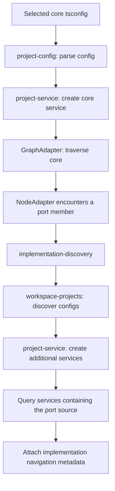

# flowLens

Implementation discovery searches TypeScript projects inside the nearest enclosing
Git root (including Git worktrees). Outside Git, it searches within the selected
config's directory. There is no workspace-root override. Graph traversal still
uses the selected project; discovered implementations are navigation targets and
do not add adapter bodies to the graph.

Each discovered project uses its own compiler settings and module resolution.
Discovery uses TypeScript's built-in source redirection for project references,
subject to `disableSourceOfProjectReferenceRedirect`. Declaration files and
`node_modules` are excluded from navigation. Invalid additional configs produce a
warning and partial discovery; an invalid selected config still fails.

Implementation lookup relies entirely on TypeScript. In particular, TypeScript
6.0.3 can return no implementation for a port composed from intersected mapped
types such as `ScopedReads<T> & ScopedWrites<T>`, even when a class explicitly
implements the port and is visible in a dependent project. Workspace visibility
and navigation therefore do not guarantee discovery for the complete Seyna
example. The two-project fixture in `packages/analyzer-core/src/fixtures/workspace`
characterizes this limitation alongside a working plain-port case. The existing
invoice integration fixture remains useful for same-project plain interfaces.

## Implementation discovery architecture

Graph traversal uses the selected project's program. Workspace implementation
searches add navigation metadata without traversing the discovered adapter bodies.

